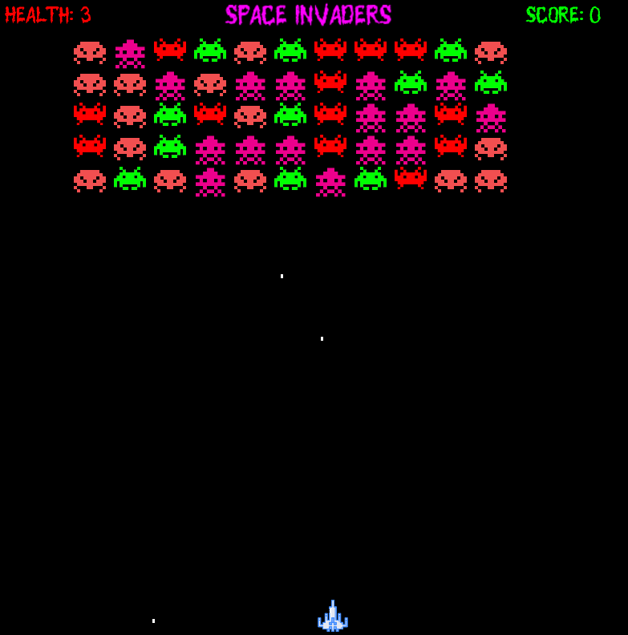

# Space Invaders

Welcome to Space Invaders! This is a classic arcade-style shooting game where the player controls a spaceship that must defend the Earth from swarms of alien invaders. 

## Game Description

The objective is to defeat wave after wave of descending aliens with a horizontally moving laser to earn as many points as possible. The player defeats an alien, and earns points, by shooting it with the laser cannon. As more aliens are defeated, the game's difficulty increases.

## Features

- Classic retro-style arcade gameplay
- Intuitive controls for spaceship movement and shooting
- Challenging levels with increasing difficulty
- High score tracking to compete with friends and family

## How to Play

1. Use the left and right arrow keys to move your spaceship horizontally.
2. Press the spacebar to shoot laser beams at the descending aliens.
3. Dodge the alien attacks and prevent them from reaching the bottom of the screen.
4. Aim for high scores by defeating as many aliens as you can!

## Installation

1. Clone the repository to your local machine.
2. Compile and run the game using your favorite compiler.
3. Enjoy playing Space Invaders!
